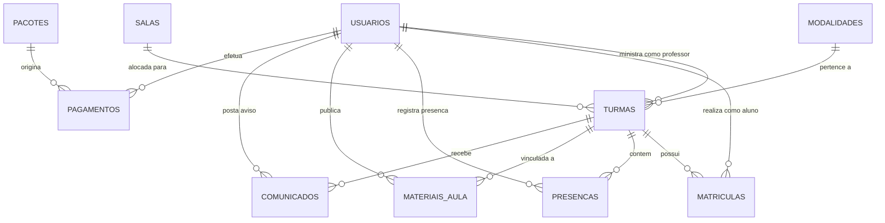

# 🩰 VibeDance — Plataforma de Gestão & Experiência para Estúdios de Dança

<p align="center">
  
  
  
  
  
</p>

---

## 📌 Sobre o Projeto

O **VibeDance** é um sistema completo desenvolvido para modernizar e dinamizar a gestão de estúdios, escolas e companhias de dança. A plataforma integra a gestão operacional, financeira e acadêmica do estúdio com uma experiência imersiva e interativa voltada para professores e alunos.

Com visual moderno inspirado nas pistas de dança e luzes cênicas (*Glassmorphism*, paleta *Dark Neon* e microinterações rítmicas), o VibeDance oferece portais especializados para cada papel de usuário com controle estrito de acesso baseado em funções (**RBAC - Role-Based Access Control**).

---

## ✨ Funcionalidades por Perfil

### 👑 Painel do Administrador (`/Admin`)
- **Dashboard Executivo com KPIs**:
  - Total de alunos ativos no estúdio;
  - Taxa média de ocupação das salas;
  - Faturamento mensal estimado;
  - Total de turmas em andamento.
- **Gestão de Salas & Lotação**: Monitoramento visual do limite de alunos e capacidade por estúdio.
- **CRUD de Usuários**: Cadastro, edição, inativação e listagem com filtros por perfil (Administrador, Professor e Aluno).
- **Gestão de Turmas**: Alocação de modalidades, professores responsáveis, salas, horários e dias da semana.
- **Gestão de Modalidades**: Cadastro de novos ritmos com categorias e ícones temáticos.

### 🕺 Painel do Professor (`/Professor`)
- **Agenda Semanal Interativa**: Visualização dinâmica de todas as aulas sob responsabilidade do docente.
- **Chamada Virtual em 1 Clique**: Registro e atualização de presença/falta de alunos por data e turma.
- **Mural de Comunicados**: Envio de avisos para as turmas com sinalização de prioridade ("Urgente").
- **Acesso a Materiais & Playlists**: Gerenciamento de trilhas sonoras e vídeos de apoio coreográfico.

### 🎵 Espaço do Aluno (`/Aluno`)
- **Minhas Aulas & Frequência**: Listagem das turmas matriculadas com indicador percentual de assiduidade.
- **Materiais de Apoio Integrados**: Acesso a playlists de treino (ex: Spotify) e gravações de passos/coreografias.
- **Exploração & Auto-matrícula**: Catálogo de turmas disponíveis com vagas restantes atualizadas em tempo real.
- **Histórico de Presenças**: Extrato completo de aulas assistidas e eventuais faltas.

### 🔐 Autenticação & Segurança
- **Login Centralizado**: Interface com validação reativa e alternância de visibilidade de senha.
- **Atalhos Rápidos de Demonstração**: Botões de login em 1 clique para agilizar testes com os diferentes perfis.
- **Proteção de Rotas (`auth-guard.js`)**: Bloqueio de acesso não autorizado a páginas restritas com base no papel do usuário.
- **Arquitetura Híbrida / Standalone**: O frontend conta com um motor reativo (`VibeStore`) em `localStorage` que funciona imediatamente sem depender de banco ativo, integrando-se de forma transparente à API REST em Spring Boot quando disponível.

---

## 🛠️ Tecnologias Utilizadas

| Camada | Tecnologias |
| :--- | :--- |
| **Frontend** | HTML5 semântico, CSS3 (Custom Properties, Flexbox, Grid, Glassmorphism, Neon Glow), JavaScript ES6+ (Design Patterns IIFE/Modular), Font Awesome 6, Google Fonts (*Outfit* e *Inter*). |
| **Backend** | Java 17+, Spring Boot, Spring Security 6, Auth0 Java JWT, Spring Data JPA, Hibernate, Maven. |
| **Banco de Dados** | PostgreSQL (Script DDL + DML completo com chaves estrangeiras, constraints e seeds). |
| **Utilitários** | Servidor web nativo local em PowerShell (`server.ps1`) para execução instantânea do frontend. |

---

## 📂 Estrutura do Projeto

```text
VibeDance/
├── backend/                    # Código-fonte da API REST Java / Spring Boot
│   ├── Modalidade/             # Módulo de Modalidades (Entidade, Repository e Controller)
│   │   ├── Modalidade.java
│   │   ├── ModalidadeController.java
│   │   └── ModalidadeRepository.java
│   ├── Turma/                  # Módulo de Turmas (Entidade, Repository e Controller)
│   │   ├── Turma.java
│   │   ├── TurmaController.java
│   │   └── TurmaRepository.java
│   └── Usuario/                # Módulo de Autenticação e Usuários
│       ├── AutenticacaoController.java
│       ├── AutenticacaoService.java
│       ├── SecurityConfigurations.java
│       ├── TokenService.java
│       ├── UsuarioRepository.java
│       └── usuario.java
├── database/                   # Modelagem e Scripts SQL Relacionais
│   └── db.sql                  # Script DDL (11 tabelas) + Seeds de demonstração
├── frontend/                   # Interface Web SPA / Multi-page
│   ├── Admin/                  # Portal do Administrador (admin.html, admin.js)
│   ├── Aluno/                  # Portal do Aluno (aluno.html, aluno.js)
│   ├── Professor/              # Portal do Professor (professor.html, professor.js)
│   ├── css/                    # Folhas de estilo modulares
│   │   ├── components.css      # Botões, cards, tabelas, modais e badges
│   │   └── theme.css           # Variáveis de cores neon, tipografia e sombras
│   ├── js/                     # Bibliotecas centrais de suporte
│   │   ├── auth-guard.js       # Verificação de sessão e proteção de rotas
│   │   ├── auth.js             # Módulo de autenticação e emissão/validação de tokens
│   │   ├── state.js            # Armazenamento e gerenciador reativo de estado (VibeStore)
│   │   └── ui.js               # Gerenciador de Toasts, saudações e modais
│   ├── app.js                  # Conector entre a camada de apresentação e a API
│   ├── index.html              # Tela de Login e apresentação do estúdio
│   ├── login.js                # Lógica do formulário de autenticação
│   └── styles.css              # Estilos complementares
├── pom.xml                     # Dependências de Segurança do Spring Boot (Security & JWT)
├── server.ps1                  # Servidor Web estático local em PowerShell
└── README.md                   # Documentação do projeto
```

---

## 🔑 Credenciais de Demonstração (Seeds)

O projeto já vem configurado com contas de teste prontas para uso tanto no banco de dados quanto no modo *standalone* (`VibeStore`):

| Perfil | Nome | E-mail de Acesso | Senha |
| :--- | :--- | :--- | :--- |
| **Administrador** | Administrador Vibe | `admin@vibedance.com` | `admin123` |
| **Professor** | Prof. Diego Santos | `prof.diego@vibedance.com` | `prof123` |
| **Professor** | Profa. Camila Dança | `prof.camila@vibedance.com` | `prof123` |
| **Aluno** | Juliana Paiva | `aluno.juliana@vibedance.com` | `aluno123` |
| **Aluno** | Lucas Rocha | `aluno.lucas@vibedance.com` | `aluno123` |
| **Aluno** | Mariana Lima | `aluno.mariana@vibedance.com` | `aluno123` |
| **Aluno** | Gabriel Souza | `aluno.gabriel@vibedance.com` | `aluno123` |

> 💡 **Dica**: Na tela de login (`frontend/index.html`), você pode clicar nos cards de acesso rápido no rodapé da página para preencher automaticamente as credenciais de teste!

---

## 🚀 Como Executar o Projeto

### 1. Executando o Frontend

O frontend não necessita de Node.js instalado para ser executado. Você pode utilizar o script embutido em PowerShell ou uma extensão como o *Live Server* do VS Code.

#### Opção A — Pelo script PowerShell (Recomendado no Windows):
1. Abra um terminal PowerShell na raiz do projeto:
   ```powershell
   .\server.ps1
   ```
2. O script iniciará o servidor na porta `5500` (ou `8081` como alternativa) e abrirá automaticamente o navegador na página de login:
   ```text
   http://localhost:5500/
   ```

#### Opção B — Pelo VS Code (Live Server):
1. Abra a pasta `VibeDance` no VS Code.
2. Clique com o botão direito em `frontend/index.html` e selecione **"Open with Live Server"**.

---

### 2. Configurando o Banco de Dados (PostgreSQL)

O arquivo `database/db.sql` contém a estrutura completa de 11 tabelas relacionais com chaves estrangeiras e inserção de dados iniciais.

1. Abra o seu cliente PostgreSQL preferido (pgAdmin, DBeaver ou via terminal `psql`).
2. Crie uma base de dados chamada `vibedance`:
   ```sql
   CREATE DATABASE vibedance;
   ```
3. Execute o script contido em `database/db.sql`:
   ```bash
   psql -U postgres -d vibedance -f database/db.sql
   ```

---

### 3. Executando o Backend (Spring Boot)

O backend do VibeDance está estruturado com controllers, repositories e camada de segurança Spring Security stateless com JWT.

1. Certifique-se de possuir o **JDK 17+** e o **Apache Maven** instalados.
2. Configure as credenciais de acesso ao seu PostgreSQL em `src/main/resources/application.properties`:
   ```properties
   spring.datasource.url=jdbc:postgresql://localhost:5432/vibedance
   spring.datasource.username=postgres
   spring.datasource.password=sua_senha
   spring.jpa.hibernate.ddl-auto=update
   api.security.token.secret=vibedance-senha-secreta-123
   ```
3. Compile e execute o projeto:
   ```bash
   mvn clean spring-boot:run
   ```
4. A API estará acessível em:
   ```text
   http://localhost:8080/api
   ```

---

## 📡 Endpoints da API REST

A API disponibiliza os seguintes endpoints principais:

| Método | Endpoint | Descrição | Acesso |
| :--- | :--- | :--- | :--- |
| `POST` | `/api/auth/login` | Autenticação do usuário e emissão de token JWT | Público |
| `GET` | `/api/modalidades` | Listagem de todas as modalidades ativas | Público |
| `POST` | `/api/modalidades` | Cadastro de nova modalidade de dança | Administrador |
| `GET` | `/api/turmas` | Listagem de todas as turmas cadastradas | Público |
| `POST` | `/api/turmas` | Criação de nova turma com limite de vagas | Administrador |
| `GET` | `/api/turmas/modalidade/{id}` | Busca turmas por modalidade específica | Aluno / Docente |

---

## 🗄️ Esquema de Banco de Dados Relacional

O banco de dados relacional foi planejado para atender a todas as regras de negócio de um estúdio profissional:



### Tabelas do Sistema:
1. `usuarios` — Alunos, professores e administradores com perfis e senhas criptografadas.
2. `salas` — Espaços físicos do estúdio (ex: Studio Neon, Studio Beat, Sala Harmonia) com recursos e capacidades.
3. `modalidades` — Estilos de dança (Hip Hop, Jazz Funk, Ballet, Salsa).
4. `pacotes` — Planos mensais, semestrais e aulas avulsas (*drop-in*).
5. `turmas` — Entidade central ligando modalidade, professor, sala, dias da semana e horários.
6. `matriculas` — Associação de alunos às turmas com status (ativa, trancada, cancelada).
7. `presencas` — Registro diário da chamada virtual com presença/falta e justificativa.
8. `materiais_aula` — Playlists (Spotify/Deezer), vídeos de coreografia e exercícios em PDF.
9. `comunicados` — Mural de avisos dos professores para os alunos da turma.
10. `aulas_particulares` — Agendamento de aulas particulares com instrutores.
11. `pagamentos` — Histórico financeiro com status (PIX, Cartão, Boleto).

---

## 👥 Autoria & Desenvolvimento

Projeto desenvolvido para o **Projeto Integrador da Unieuro**.

### 💻 Equipe de Desenvolvimento:
- **CALEBE FERREIRA CARVALHO**
- **JOÃO PAULO SILVA SERGIO**
- **JUAN FELIPE DE MORAIS ZANGEROLAMI**
- **MATEUS GABRIEL BEZERRA DE SOUZA**

---

<p align="center">
  <sub>Desenvolvido com 💜 e ritmo pelo time VibeDance. Entre no compasso da sua evolução!</sub>
</p>
